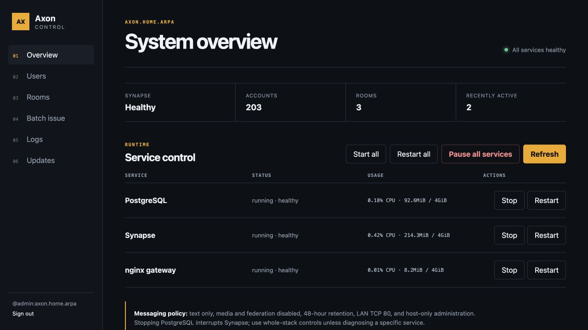
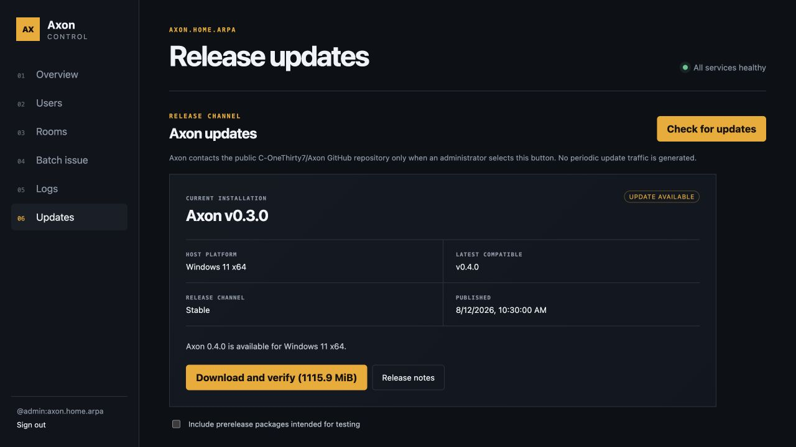

# Axon

Axon is a Matrix/Synapse deployment for controlled LAN, routed, VPN,
bare-metal, and private-cloud environments. It packages Synapse, PostgreSQL, a
minimal nginx gateway, and a host-only administration panel into a reproducible
Docker Compose stack.

Axon is messaging-first. Media, calling, federation, public room discovery,
push gateways, URL previews, and Synapse presence are disabled. Rooms are
encrypted by default and server-side event retention defaults to 48 hours.

## Choose the correct download

Download installers from [GitHub Releases](https://github.com/C-OneThirty7/Axon/releases).
Do not use GitHub's automatically generated **Source code** ZIP or TAR file for
an offline installation; those archives do not contain Docker images, Docker
Desktop, or operating-system packages.

| Axon host | Release status | Download this asset | Installation guide |
|---|---|---|---|
| Windows 11 x64 | Tested offline release | `Axon-v0.3.0-offline-win-x64.zip` | [Windows installation](docs/installation/INSTALL_WINDOWS.md) |
| Ubuntu Server 24.04 AMD64 | Validated offline release | `Axon-v0.3.0-offline-ubuntu-24.04-amd64.tar.gz` | [Linux installation](docs/installation/INSTALL_LINUX.md) |
| Debian 13 AMD64 | Installer and builder supported; no published asset yet | Build the Debian archive from source | [Linux installation](docs/installation/INSTALL_LINUX.md) |
| Linux ARM64 | Installer and builder supported; no published asset yet | Build the matching ARM64 archive from source | [Linux installation](docs/installation/INSTALL_LINUX.md) |
| macOS | Development/POC only; no supported offline installer | No end-user asset yet | [macOS status](docs/installation/INSTALL_MACOS.md) |

The operating system in this table is the **Axon server host**. Element clients
may run on Windows, macOS, Android, or iOS as allowed by the deployment network
and the client's HTTP/TLS policy.

## Windows quick start

1. Download `Axon-v0.3.0-offline-win-x64.zip`.
2. Verify its SHA-256 checksum against the release page.
3. Extract the entire ZIP to a local NTFS folder.
4. Double-click `Install Axon.cmd` and approve the administrator prompt.
5. Follow the NIC/address selection and initial-administrator prompts.

The bundle contains Docker Desktop and all required Linux container images. See
the [complete Windows guide](docs/installation/INSTALL_WINDOWS.md) before
installing on a routed or multi-NIC host.

## Linux quick start

For the published Ubuntu AMD64 bundle:

```bash
tar -xzf Axon-v0.3.0-offline-ubuntu-24.04-amd64.tar.gz
cd Axon-v0.3.0-offline-ubuntu-24.04-amd64
sudo ./installer/linux/install.sh --offline
```

The installer detects supported distributions and active IPv4 interfaces,
preserves existing NIC configuration, installs or validates Docker Engine,
loads pinned images, renders protected secrets, configures a scoped
`DOCKER-USER` firewall chain, and installs systemd services.

Common operations:

```bash
sudo axon status
sudo axon start
sudo axon stop
sudo axon restart
sudo axon logs
```

Axon Control binds only to `127.0.0.1:8780`. For a remote Linux host:

```bash
ssh -L 8780:127.0.0.1:8780 operator@axon-host
```

Then browse to `http://127.0.0.1:8780`.

## Custom administration panel

Every supported Axon deployment includes **Axon Control**, a custom web GUI
for day-to-day server administration. It runs on the host at
`http://127.0.0.1:8780` and is not exposed to Matrix client networks.

Axon Control provides:

- stack and individual-service health, resource use, logs, and controls;
- individual and batch user provisioning, password resets, role changes, and
  account locking;
- encrypted room creation, membership control, and destructive room purge;
- signed, click-through GitHub updates matched to the host platform.

The update page contacts GitHub only when an administrator clicks **Check for
updates**. A separate **Download and verify** action checks both SHA-256 and the
Axon release signature. **Install update** preserves configuration, applies the
release through the host updater, restarts the required services, and reconnects
the panel. Axon never polls or installs in the background.





## Important security boundary

The default client endpoint is HTTP for isolated networks. Matrix E2EE does not
protect login credentials, access tokens, room metadata, or traffic patterns
from an observer on an unencrypted path. Use the HTTP profile only on a trusted
physical LAN or inside an encrypted tunnel such as WireGuard. Any
internet-accessible deployment must use TLS and a deliberately designed public
deployment profile.

## Documentation

Start with the [documentation index](docs/README.md). It separates installation,
client onboarding, administration, network design, validation, and security
material. Printable PDF guides are also included.

## Repository and releases

Axon source code is licensed under the [MIT License](LICENSE). Bundled
third-party software keeps its own license; see
[third-party notices](THIRD_PARTY_NOTICES.md).

Release archives, Docker image exports, installers, databases, packet captures,
and local `.env` files are intentionally excluded from Git. Installable bundles
belong in GitHub Releases, not normal Git history.
